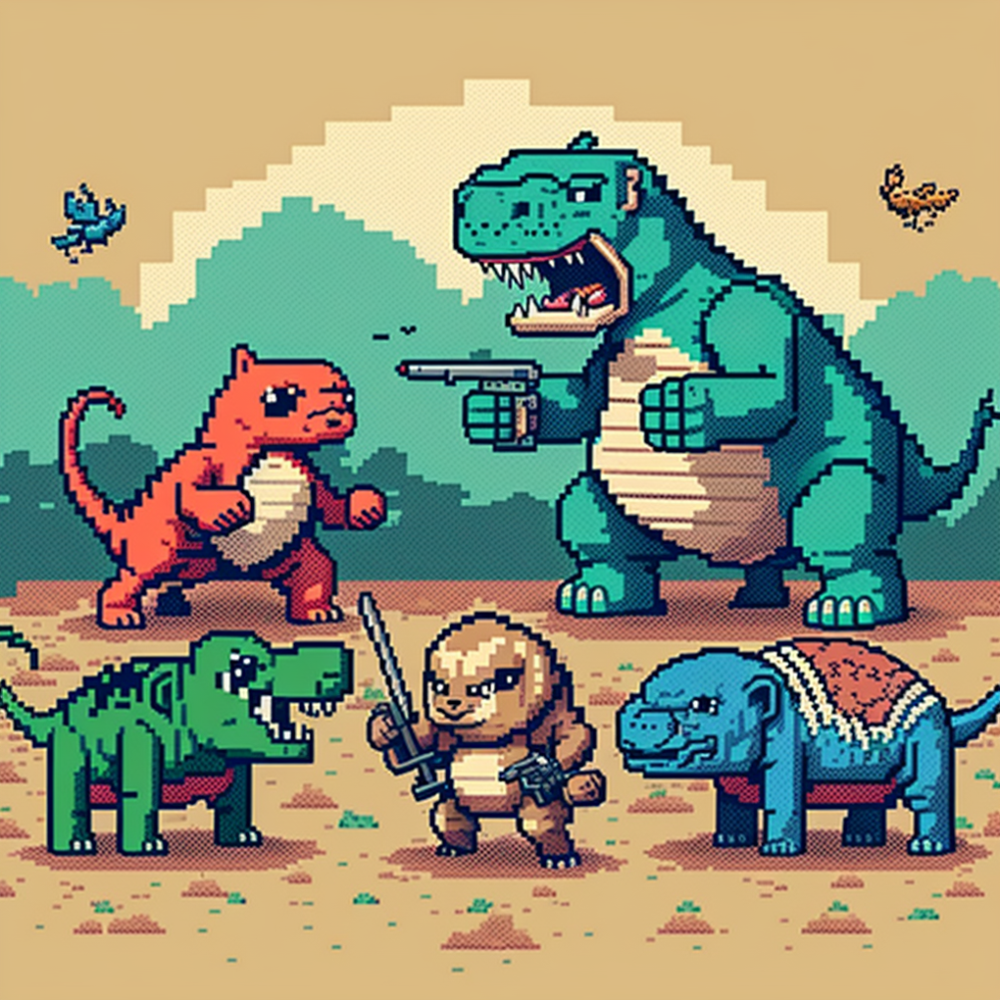
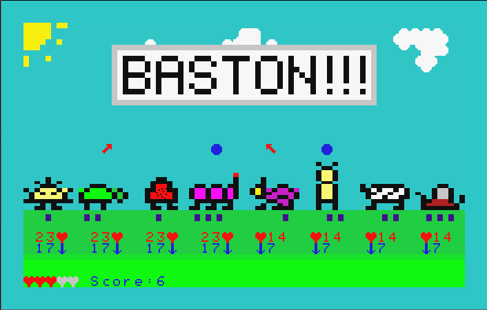
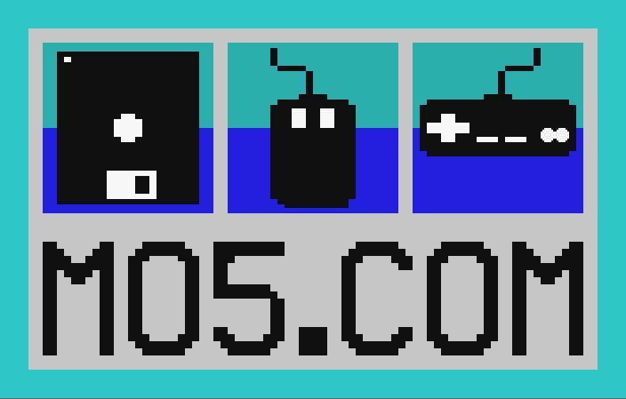

# Game Description

Mini Auto Pets is a scaled down clone of Super Auto pets for vintage computers.

The goal of the game is to manage a team of up to 4 animals that will battle against other teams, and win 10 combats. The team evolves between battles, but the battles themselves are automatic.

# Game Loop

The game loop is articulated around a loop around with 2 parts:

* The "shop", where all players interaction exists (a "turn" is a session in the shop)

* The "battle", where the teams fight each others

# High-level Mecanics

The game occurs in up to 14 turns, with the objective to get 10 victories before getting 5 defeats.

Every two turns, specific animals and perks are unlocked in the shop and can appear in the selection.

The team building part of the game is assembling an ordered set of up to 4 animals, each having an optional single perk. The animals have 2 stats ("attack"/"health") and an "experience" (from 1 to 3), that changes the stats. In addition, every animal have an optional power that is automatically triggered at specific points during the game and varies with experience.

At some point, the player goes in battle, which ends its turn.

Player's team is saved and restored indetically after battle (ie: what happens in the battlefield stays on the battlefield).

The battles are done between the players team and a randomly choosen team at the same turn, with a similar number of victories. Those pre-made teams are included in the game binary and defines the "opposition" one has to beat.

The battle is done by having each front animal attacking each other, until a team has no animal left.

There are no ties, if both teams have no animals left, the player have lost.

If player won 10 battles, the games end on a vicroty.

If player lost 5 battles, the games end on a defeat.

In all other cases, the player goes back to the shop to prepare for the next battle.

# UI & Interactions

## Shop

### Shop UI

The UI of the shop is composed of:

* The team view, with the 4 animals

* The shop view, separated in 2:

    * The animal shop, containing up to 4 animals that can be aquired

    * The perk shop, containing up to 2 perks that can be acquired

    * UI items, consisting of:

        * The score

        * The amount of money the player has

        * Buttons to abort the game, refresh the shop, "end turn" (start battle)

### Shop actions

The actions possible in the shop are:

    * Sell animals or empty spots

    * Re-order animals

    * Sell one animal

    * Merge animals

    * Buy an animal into an empty space

    * Buy a perk for an animal

    * Reroll the shop (?)
    
    * End turn
    
    * (abord, help, maybe?)
  
## Battle

### Battle UI

The UI of the battle is composed of two opposite team views, and a score board.

[to be completed]

